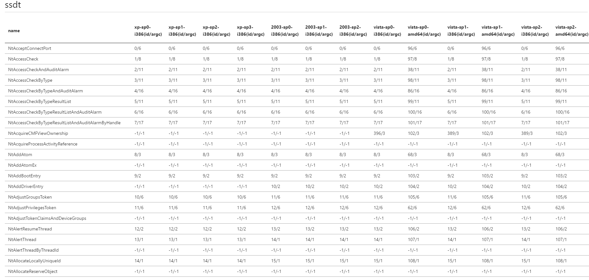
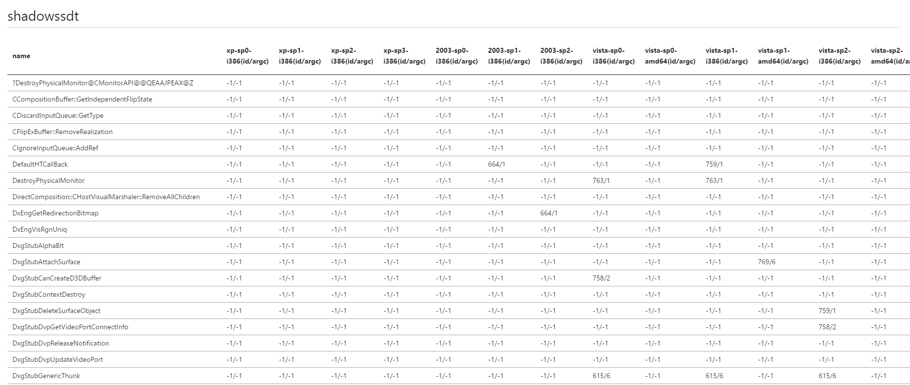

# windows kernel syscall table
the final version of syscall table include id and argc support xp sp0 ~ 10 rs4

author: ( <a href="https://twitter.com/TinySecEx" target="_blank">@TinySec</a> )

## SSDT

## SHADOW SSDT
